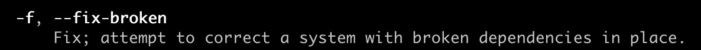

## 常用命令
### update ，upgarde 和dist-upgrade 的区别
> update是下载源里面的metadata的. 包括这个源有什么包, 每个包什么版本之类的.<br>
> upgrade是根据update命令下载的metadata决定要更新什么包(同时获取每个包的位置).<br>
> upgrade:系统将现有的Package升级,如果有相依性的问题,而此相依性需要安装其它新的Package或影响到其它Package的相依性时,此Package就不会被升级,会保留下来. <br>
> dist-upgrade:可以聪明的解决相依性的问题,如果有相依性问题,需要安装/移除新的Package,就会试着去安装/移除它. (所以通常这个会被认为是有点风险的升级) <br>
> apt-get upgrade 和 apt-get dist-upgrade 本质上是没有什么不同的。只不过，dist-upgrade 会识别出当依赖关系改变的情形并作出处理，而upgrade对此情形不处理。<br>
 
### apt-get -f install
-f参数为--fix-broken的简写形式，可以在man apt-get 中搜索-f参数查询到其帮助信息。

-f参数的主要作用是是修复依赖关系（depends），假如用户的系统上有某个package不满足依赖条件，这个命令就会自动修复，安装程序包所依赖的包。

### apt-get clean
apt-get安装的软件包会存储在/var/cache/apt/archives/和/var/cache/apt/archives/partial/两个目录下，长期使用会占用硬盘空间。clean指令就是删除掉这两个目录中的软件包，除了已经被锁定的文件。

### apt-get autoclean
同样是这两个目录下的软件包，不同的是autoclean只删除不能被再次下载的软件包，所以说apt-get clean删除清理更彻底。autoclean的官方定义：

### dpkg
dpkg 是Debian package的简写，为”Debian“ 操作系统 专门开发的套件管理系统，用于软件的安装，更新和移除。所有源自"Debian"的Linux的发行版都使用 dpkg,   例如"Ubuntu"<br>
> ```dpkg -i <.deb file name> ```安装软件 <br>
> ```dpkg -L package```列出与该包先关联的文件 <br>
> ```dpkg -l package```显示包的版本 <br>
> ```dpkg -r package ```移除软件（保留配置）<br>
> ```dpkg -P package```移除软件（不保留配置） <br>
> ```dpkg -s package```查找包的详细信息 <br>

### apt-get remove 与 purge的区别
> ```apt-get remove ```会删除软件包而保留软件的配置文件  <br>
> ```apt-get purge```会同时清除软件包和软件的配置文件  <br>
